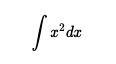
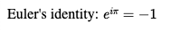

# MathJax3 - React

React component to easily load MathJax **v3** and process **dynamically** raw ASCIIMath, TeX or MathML content.

## Installation

NPM:

`npm install mathjax3-react --save`

YARN:

`yarn add mathjax3-react`

## Basic usage

#### From HTML String

```javascript
import React from 'react';
import { MathJaxProvider, MathJaxHtml } from 'mathjax3-react';

function App() {
  return (
    <div>
      <MathJaxProvider>
        <MathJaxHtml html={html} />
      </MathJaxProvider>
    </div>
  );
}
```

HTML string:

```javascript
const html = `
<p>Let's analise this equation:</p>
<p style="text-align:center;">
  <math xmlns="http://www.w3.org/1998/Math/MathML" display="block">
    <msup>
      <mrow>
        <mi>r</mi>
      </mrow>
      <mrow>
        <mn>2</mn>
      </mrow>
    </msup>
    <mo>+</mo>
    <msup>
      <mrow>
        <mi>z</mi>
      </mrow>
      <mrow>
        <mn>2</mn>
      </mrow>
    </msup>
    <mo>=</mo>
    <mn>4</mn>
  </math>
</p>
`;
```

Result:


### TeX or AsciiMath formula

```javascript
import React from 'react';
import { MathJaxProvider, MathJaxFormula } from 'mathjax3-react';

function basicUsage() {
  return (
    <div>
      <MathJaxProvider>
        <MathJaxFormula formula="$$\int x^2dx$$" />
      </MathJaxProvider>
    </div>
  );
}

export default basicUsage;
```

Result:



### Custom options

You can set custom script url or MathJax by sending them as props to `MathJax.Provider` component

```javascript
import React from 'react';
import { MathJaxProvider, MathJaxFormula } from 'mathjax3-react';

function customOptions() {
  return (
    <div>
      <MathJaxProvider
        url="https://cdn.jsdelivr.net/npm/mathjax@3/es5/tex-chtml.js"
        options={{
          tex: {
            inlineMath: [
              ['$', '$'],
              ['\\(', '\\)'],
            ],
          },
        }}
      >
        <MathJaxFormula formula="Euler's identity: $e^{i\pi} = -1$" />
      </MathJaxProvider>
    </div>
  );
}

export default customOptions;
```

Result:



**Which options are available?**

Options props are exactly the same options used in MathJax lib. So you can use [official MathJax documentation](https://docs.mathjax.org/en/latest/web/configuration.html) to set custom options.

### Custom Input

```javascript
import React, { useState } from 'react';
import { MathJaxProvider, MathJaxFormula } from 'mathjax3-react';

function CustomInput() {
  const [value, setValue] = useState('\\int_{-\\infty}^{+\\infty} e^{-x^2} dx = \\sqrt{\\pi}');

  return (
    <div className="App">
      <h1>Custom Math Input</h1>
      <input type="text" value={value} onChange={(e) => setValue(e.target.value)} style={{ width: '100%' }} />
      <MathJaxProvider>
        <MathJaxFormula formula={'$$' + value + '$$'} />
      </MathJaxProvider>
    </div>
  );
}

export default CustomInput;
```

## MathJaxProvider Component

The `MathJaxProvider` component must be used as a parent for the `MathJaxHtml` and `MathJaxFormula` components. This is essential because `MathJaxProvider` is responsible for loading the MathJax script, which the `MathJaxHtml` or `MathJaxFormula` components will consume and utilize.

**Rationale Behind This Design**

Loading MathJax is a resource-intensive process. To optimize performance, `MathJaxProvider` should be placed high in your component hierarchy to load the MathJax script only once. This approach prevents the script from being reloaded unnecessarily and allows `MathJaxHtml` and `MathJaxFormula` components to operate within contexts that update more frequently, thereby leveraging the pre-loaded MathJax script efficiently.
